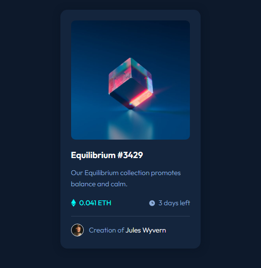

# NFT preview card component solution

This is a solution to the [NFT preview card component challenge on Frontend Mentor](https://www.frontendmentor.io/challenges/nft-preview-card-component-SbdUL_w0U). 

## Overview

### The challenge

The challenge was basically create a card component using the given design preview.

It was a very beginner challenge, where I used only HTML and CSS. But it was very useful, because I was able to train my CSS skills and my ability to visually perceive elements, in order to clone the styles without using a design sketch.

### Screenshot

This is a screenshot of my solution. I tried to make it as similar as possible.

To see it in your browser e experience the hover effect, I recommend visiting the links below.

### Links

- Solution URL: [Add solution URL here](https://your-solution-url.com)
- Live Site URL: [Add live site URL here](https://your-live-site-url.com)
